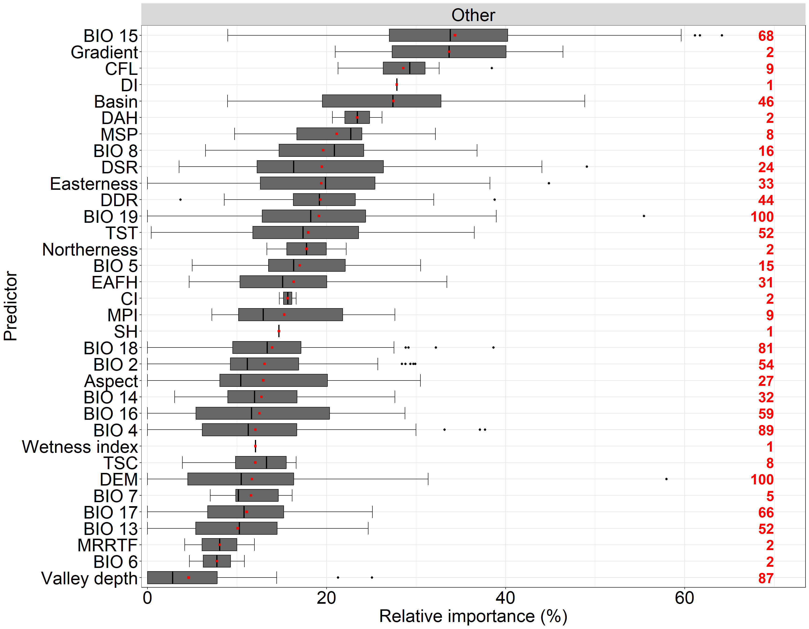
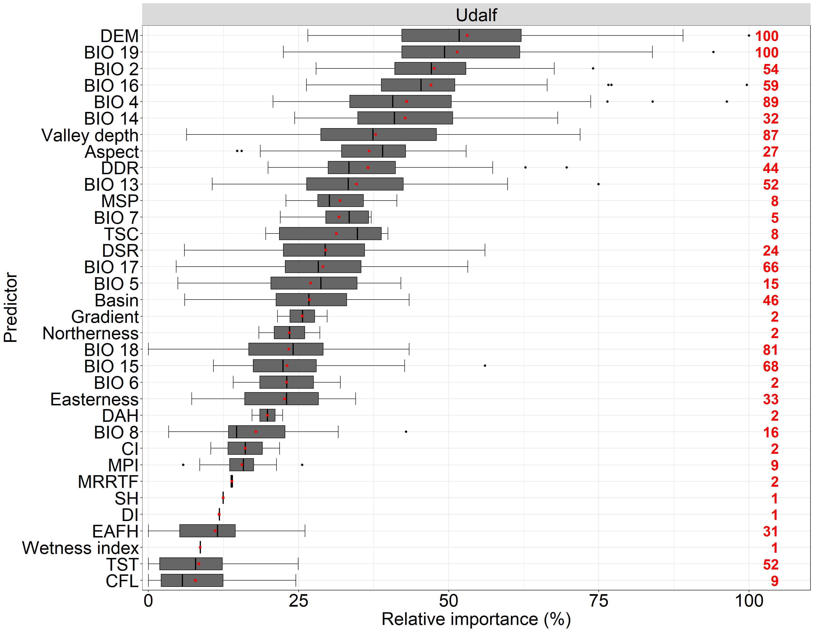
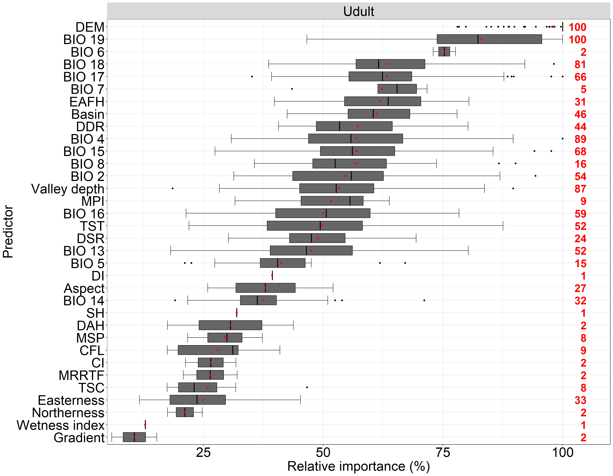
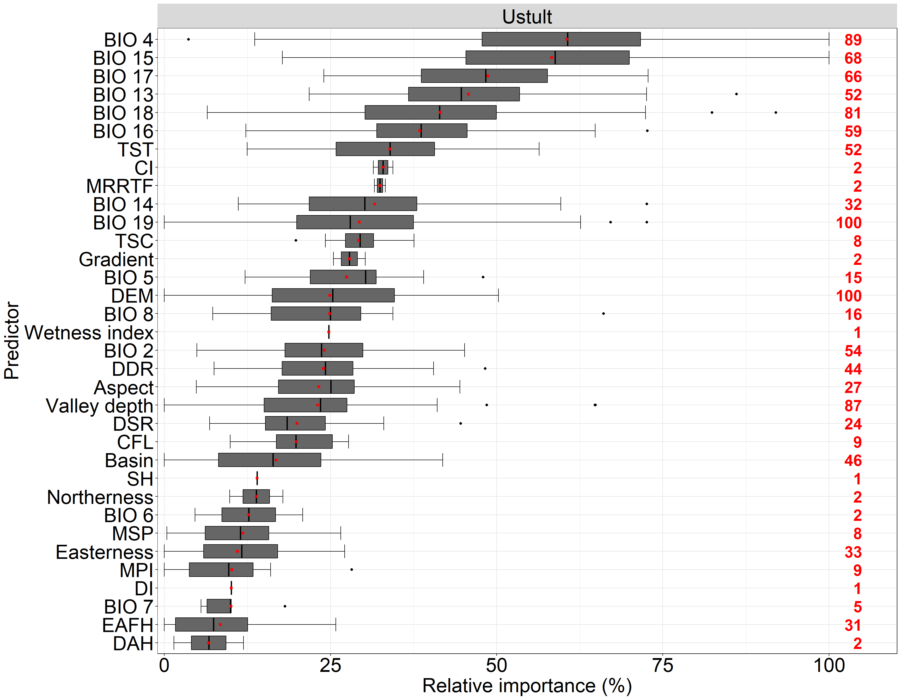

## Loading packages
```{r message=FALSE, warning=FALSE}
pkg <- c("dplyr", "ggplot2", "stringr", "tidyr", "RColorBrewer", "data.table")

sapply(pkg, require, character.only = T)
```

## Cleaning the environment (removing objects and previously loaded packages)
```{r message=FALSE, warning=FALSE}
rm(list = ls())  
gc()
```

## Loading importance data
```{r message=FALSE, warning=FALSE}
df_imp <-  list.files(path = "./classification/results", pattern = ".csv$", full.names = T, recursive = T) %>% 
  grep(pattern = "imp_pred_TOTAL", value = T)  %>% 
  read.csv2()
```

## Categorical predictors 
```{r message=FALSE, warning=FALSE}
varfact <- c("geology", "drainage", "landforms_tpi_based",
             "surface_specific_points", "lulc",
             "terrain_surface_classification_iwahashi", "soil", "slope_idx",
             "valley_idx") %>% sort()

for (h in seq_along(varfact)) {
  
  df_imp <- df_imp %>% 
    mutate(predictor = str_replace(predictor, paste0(".*", varfact[h], ".*"),
                                   varfact[h]))
}
```

## Calculating average importance of categorical variables
```{r message=FALSE, warning=FALSE}
df_imp <- df_imp %>% 
  group_by(rep, predictor, class) %>% 
  summarise(importance = mean(importance))
```

## Loading a dataframe with final name of variables and function for counting repetitions
```{r message=FALSE, warning=FALSE}
n_cova <- read.csv2("./data/name_cova.csv")
print(n_cova)

dfg_imp <- left_join(df_imp, n_cova, by = c("predictor" = "name_abr"))%>% 
  mutate(class = factor(class,
                        levels = sort(unique(df_imp$class)))) 


n_fun1 <- function(x) {
  return(data.frame(y = 3.5 * 20,
                    label = length(x)))
}


n_fun2 <- function(x) {
  return(data.frame(y = 3.5 * 30,
                    label = length(x)))
}

n_clas <- dfg_imp$class %>% sort() %>% unique() %>% as.character()
```

## Plotting boxplots
```{r message=FALSE, warning=FALSE, fig.width=10, fig.height=5}
for (i in seq_along(n_clas)) {
  
  if (i == 1) {
    imp_pred <- ggplot(filter(dfg_imp, class == n_clas[i]),
                       aes(x = importance,
                           y = reorder(name_comp, importance,
                                       decreasing = T))) +
      stat_boxplot(geom = "errorbar", size = 0.5) +
      geom_boxplot(color = "black", fill = "grey40") +
      scale_fill_manual(values = colorRampPalette(brewer.pal(7, "Set2"))(5)) +
      scale_y_discrete(limits = rev) +
      labs(y = "Predictor", fill = "Depth (cm)",
           x = "Relative importance (%)", y = NULL) +
      scale_x_continuous(expand = c(0.01, 0, 0.05, 0)) +
      theme(axis.ticks = element_line(color = "black"),
            strip.text = element_text(color = "black", size = 28),
            panel.background = element_blank(),
            panel.border = element_rect(fill = NA, inherit.blank = T),
            panel.grid = element_line(colour = "grey90"),
            axis.text = element_text(color = "black", size = 28),
            axis.title = element_text(color = "black", size = 28),
            legend.position = c(0.83, 0.25),
            legend.text = element_text(size = 17, color = "black"),
            legend.title = element_text(size = 17, color = "black")) +
      facet_wrap(~class, nrow = 1) +
      stat_summary(fun.data = n_fun1, geom = "text", col = "red", size = 8,
                   hjust = 1, position = position_dodge(0.6),
                   aes(group = class),
                   fontface = "bold") +
      stat_summary(fun = mean, geom = "point", col = "red", shape = 15, size = 1.5,
                   position = position_dodge(0.75)) ; imp_pred
    
    
    
  } else {
    
    imp_pred <- ggplot(filter(dfg_imp, class == n_clas[i]),
                       aes(x = importance,
                           y = reorder(name_comp, importance,
                                       decreasing = T))) +
      stat_boxplot(geom = "errorbar", size = 0.5) +
      geom_boxplot(color = "black", fill = "grey40") +
      scale_fill_manual(values = colorRampPalette(brewer.pal(7, "Set2"))(5)) +
      scale_y_discrete(limits = rev) +
      labs(y = "Predictor", fill = "Depth (cm)",
           x = "Relative importance (%)", y = NULL) +
      scale_x_continuous(expand = c(0.01, 0, 0.05, 0)) +
      theme(axis.ticks = element_line(color = "black"),
            strip.text = element_text(color = "black", size = 28),
            panel.background = element_blank(),
            panel.border = element_rect(fill = NA, inherit.blank = T),
            panel.grid = element_line(colour = "grey90"),
            axis.text = element_text(color = "black", size = 28),
            axis.title = element_text(color = "black", size = 28),
            legend.position = c(0.83, 0.25),
            legend.text = element_text(size = 17, color = "black"),
            legend.title = element_text(size = 17, color = "black")) +
      facet_wrap(~class, nrow = 1) +
      stat_summary(fun.data = n_fun2, geom = "text", col = "red", size = 8,
                   hjust = 1, position = position_dodge(0.6),
                   aes(group = class),
                   fontface = "bold") +
      stat_summary(fun = mean, geom = "point", col = "red", shape = 15, size = 1.5,
                   position = position_dodge(0.75)) ; imp_pred
    
  }
  
  
  
}
```

<p align="center">

</p>

<p align="center">

</p>

<p align="center">

</p>

<p align="center">

</p>

